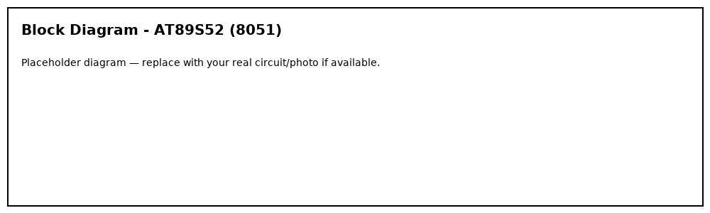
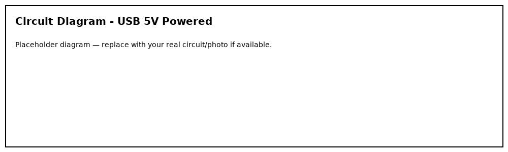
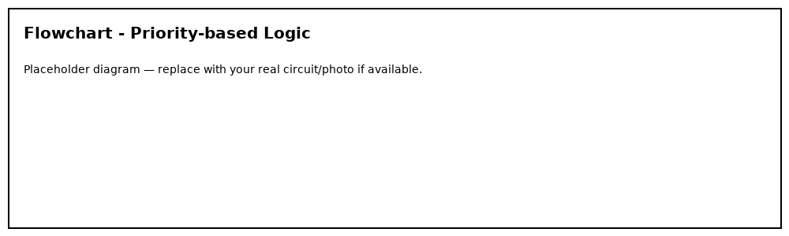
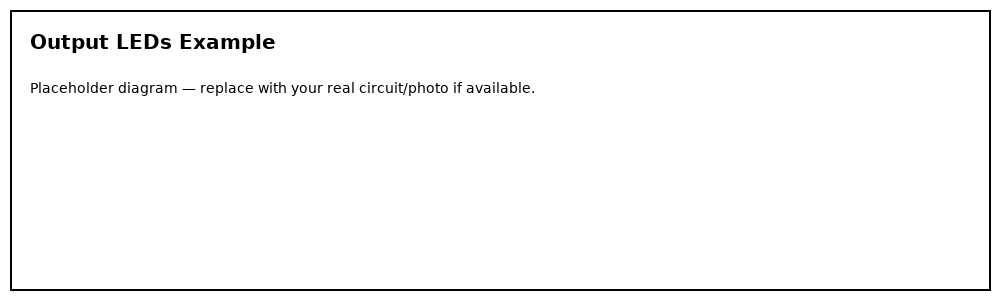

# 🚦 Density-Based Traffic Light Control System (8051)

**Author:** Rahul Trivedi, M.Tech

---

## 🧠 Overview
Plain Embedded C implementation for a priority-based density traffic light control system using AT89S52.
Uses 8 IR sensors (2 per lane) and step-wise timing (5/10/20s).

---

## 🧩 Short Algorithm
1. Initialize ports
2. Read 8 IR sensors
3. Compute presence per lane (0..2)
4. Select lane with highest score (priority)
5. Map score to duration (5/10/20s)
6. Set chosen lane GREEN, others RED
7. Delay -> Yellow 2s -> All red 1s -> Loop

---

## 📊 Working Logic Table
| Density | Green (s) |
|--------:|:---------:|
| 0-2     | 5         |
| 3-6     | 10        |
| >=7     | 20        |

---

## Figures

---

## Keil µVision & Flash Magic
See earlier instructions in project README. Compile main.c in Keil to generate HEX and flash using Flash Magic.

---

MIT © 2025 Rahul Trivedi
